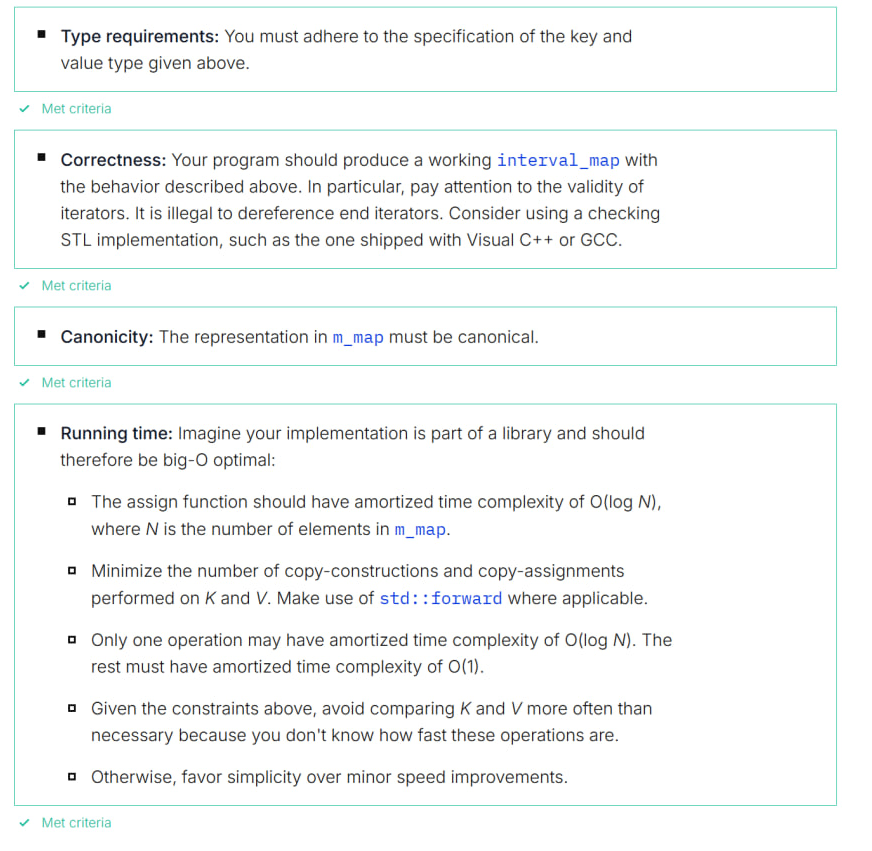

# interval_map

Correct implementation of `interval_map` data structure


## Task description

`interval_map<K, V>` is a data structure that associates keys of type K with values of type V. It is designed to be used efficiently in situations where intervals of consecutive keys are associated with the same value. Your task is to implement the assign member function of this data structure, which is outlined below.

`interval_map<K, V>` is implemented on top of `std::map`. For more information on `std::map`, you may refer to cppreference.com.

Each key-value pair (k,v) in `interval_map<K, V>::m_map` means that the value v is associated with all keys from k (including) to the next key (excluding) in `m_map`. The member `interval_map<K , V>::m_valBegin` holds the value that is associated with all keys less than the first key in `m_map`.

Example: Let M be an instance of `interval_map<int , char>` where 

```
M.m_valBegin== 'A',
M.m_map=={ (1, 'B') , (3, 'A') },
```

Then M represents the mapping 

```
...
-2 -> 'A'
-1 -> 'A'
0 -> 'A'
1 -> 'B'
2 -> 'B'
3 -> 'A'
4 -> 'A'
5 -> 'A'
...
```

The representation in the `std::map` must be canonical, that is, consecutive map entries must not contain the same value: `..., (3, 'A' ), (5 , 'A'), ...` is not allowed. Likewise, the first entry in `m_map` must not contain the same value as `m_valBegin`. Initially, the whole range of K is associated with a given initial value, passed to the constructor of the `interval_map<K, V>` data structure. 

## Key type K
* supports copy and move construction, as well as copy and move assignment,
* is less-than comparable via `operator<`,
* does not implement any other operations, in particular no equality comparison or arithmetic operators.

## Value type V 
* supports copy and move construction, as well as copy and move assignment,
* is equality-comparable via `operator==`,
* does not implement any other operations.

You are given the following source code:
```
template<typename K, typename V>
class interval_map {
	friend void IntervalMapTest();
	std::map<K, V> m_map;
	const V m_valBegin;
public:
	// constructor associates whole range of K with val
	template<typename V_forward>
	interval_map(V_forward&& val) :
		m_valBegin(std::forward<V_forward>(val))
	{}

	// Assign value val to interval [keyBegin, keyEnd).
	// Overwrite previous values in this interval.
	// Conforming to the C++ Standard Library conventions, the interval
	// includes keyBegin, but excludes keyEnd.
	// If !( keyBegin < keyEnd ), this designates an empty interval, and assign must do nothing.
	template<typename V_forward>
	void assign(const K& keyBegin, const K& keyEnd, V_forward&& val) requires (std::is_same<std::remove_cvref_t<V_forward>, V>::value)
	{

	}

	// look-up of the value associated with key
	const V& operator[](const K& key) const {
		auto it = m_map.upper_bound(key);
		if (it == m_map.begin()) {
			return m_valBegin;
		}
		else {
			return (--it)->second;
		}
	}
};

// Many solutions we receive are incorrect. Consider using a randomized test
// to discover the cases that your implementation does not handle correctly.
// We recommend to implement a test function that tests the functionality of
// the interval_map, for example using a map of int intervals to char.
```

Your task is to implement the function `assign`. Your implementation is graded according to the following criteria, in this order:

**Type requirements**: You must adhere to the specification of the key and value type given above.

**Correctness**: Your program should produce a working `interval_map` with the behavior described above. In particular, pay attention to the validity of iterators. It is illegal to dereference end iterators. Consider using a checking STL implementation, such as the one shipped with Visual C++ or GCC.

**Canonicity**: The representation in `m_map` must be canonical.

**Running time**: Imagine your implementation is part of a library and should therefore be big-O optimal:
* The assign function should have amortized time complexity of O(log
N), where N is the number of elements in `m_map`.
* Minimize the number of copy-constructions and copy-assignments
performed on K and V. Make use of `std::forward` where applicable.
* Only one operation may have amortized time complexity of O(log N). The rest must have amortized time complexity of 0(1).
* Given the constraints above, avoid comparing K and V more often than
necessary because you don't know how fast these operations are.
* Otherwise, favor simplicity over minor speed improvements.
